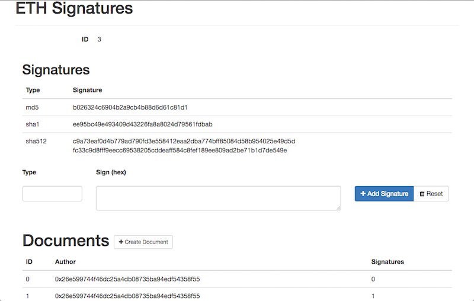

= Toporick

Toporick is an Ethereum DApp for making agreements based on signatures of off-chain entities in the blockchain.
This can be signatures of digital documents, images, PDF or any other file.

The plan is to make a collection of Smart Contracts, which will be helpful for making an agreement
based on references to the off-chain digital documents.

Roadmap:

  * [x] publish signatures to blockchain - Basic Signature
  * [ ] add signatures from multiple parties
  * [ ] publish UI
  * [ ] verification rules for a document
  ** [ ] timeframe
  ** [ ] same signatures from multiple parties
  ** [ ] required types of signatures
  * [ ] integrate into Mist
  * [ ] command line tools

== Basic Signature contract

Contract is deployed at address: 0x0000 < NOT YET >

Supposed to be used as a distributed storage for digital signatures. Like "_keep md5 of this file forever_".

Use case:

 * publish signatures of a downloadable file for a validation (like what we have for Ethereum client itself, published on
 official repo; now it can also be published into blockchain)
 * demonstrate proof of document existence at a point of time

Notice that unlike to existing way of publishing such signatures on a website/ftp, publishing to blockchain through
   Toporick, it protects signatures from forgery. Once it published on blockchain, it stays here forever.

It allows to:

 * create a _document_
 * add an unlimited number of _signatures_ to this document
 * the signature consists of:
 ** _type_  - a name for signature. ASCII bytes, up to 16 characters long
 ** _value_ - signature value, a byte array
 * only document author can add signatures to a document

Notice that `type` and `value` could be anything, not restricted to any particular hash name or value.
  Which allows to store ordinary key-value pairs here. May be a metadata like "_filename=<filename in ascii>_".

.Example 1, with standard signatures
|=======================================================
2+| Document 1001
| SHA256     | 4a50dbce1d08d3299a7bada8654ee1bc43ec8fe5f7c9b468b5ae85f89c663214
| SHA512     | c9a73eaf0d4b779ad790fd3e558412eaa2dba774bff85084d58b954025e49d5d fc33c9d8fff9eecc69538205cddeaff584c8fef189ee809ad2be71b1d7de549e
|=======================================================

.Example 2, with additional information about the document
|=======================================================
2+| Document 1002
| Type       | _< File >_
| Filename   | _< README.adoc >_
| Size       | 320E0
| MD5        | 22644302c3e19ebe6dec2a59e388bfe8
| SHA1       | ee95bc49e493409d43226fa8a8024d79561fdbab
|=======================================================

== Dapp UI

There're a standalone UI to operate this contracts, that can be run on any computer with access to Ethereum node
via RPC. The app is built using ConsenSys Truffle and React + Redux.

=== Build and Run UI

.Install requirements
----
npm install -g truffle
npm install
----

.Start test RPC
----
./node_modules/ethereumjs-testrpc/bin/testrpc
----

.Deploy contract
----
truffle deploy
----

.Run app
----
truffle serve
----

Here we are

== Licence

MIT